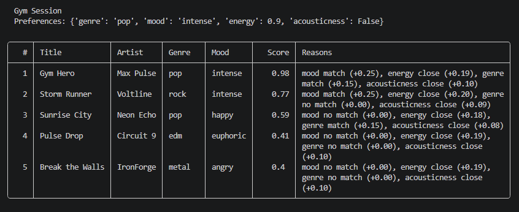
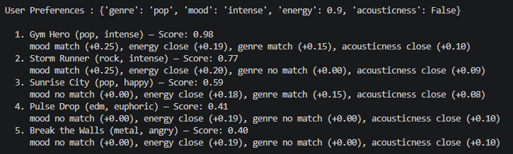
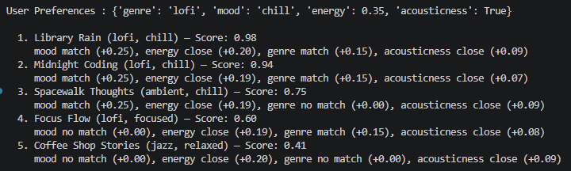
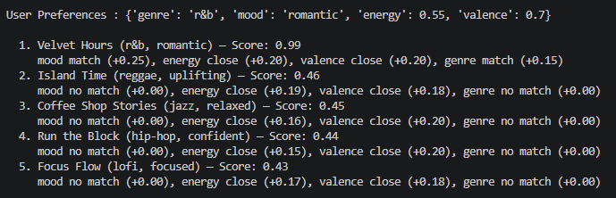
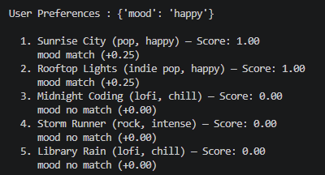
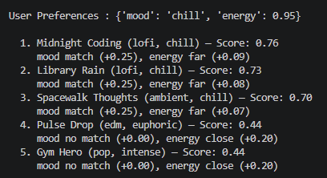
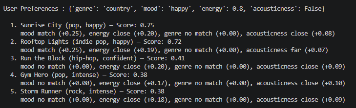

# 🎵 Music Recommender Simulation

## Project Summary

This project is a lightweight recommender system that suggests songs from a catalog based on a listener’s preferences. It uses predefined inputs such as genre, mood, and other attributes to evaluate how well each song matches the user.

The system assigns a score to each song based on these preferences and returns a ranked list, with the strongest matches appearing first.

---

## Sample Output



---

## How The System Works

This simulation focuses on **content-based filtering** — the same technique that powers Spotify's audio analysis features. Given a user taste profile, each song in the catalog is scored by how closely its attributes match the user's preferences. Songs are then ranked by score and the top matches are returned as recommendations. The system rewards *closeness to preference* rather than simply favoring high or low values.

### `Song` Features

- `genre` (categorical) — broad style label (pop, lofi, rock, jazz, etc.)
- `mood` (categorical) — intended emotional tone (chill, happy, intense, moody, etc.)
- `energy` (numerical) — overall intensity and activity level (0–1)
- `valence` (numerical) — musical positivity; high = upbeat, low = somber (0–1)
- `tempo_bpm` (numerical) — speed of the track in beats per minute
- `danceability` (numerical) — how suited the track is for dancing (0–1)
- `like_acousticness` (numerical) — organic/acoustic vs. electronic texture (0–1)

#### `UserProfile` Fields

- `favorite_genre` — categorical preference
- `favorite_mood` — categorical preference
- `target_energy` — numeric preference (0–1 scale)
- `likes_acoustic` — bool

### Scoring Rule

For numeric features: `score = 1 - |user_preference - song_value|`
For categorical features (`mood`, `genre`): binary match (1 if match, 0 if not)

Weighted sum across all features — `mood` (0.25), `energy` (0.20), `valence` (0.20), `genre` (0.15), `acousticness` (0.10), `tempo_bpm` (0.05), `danceability` (0.05).

### Ranking Rule

All songs scored independently → sorted descending by total score → top N returned.

### Potential Biases

**1. Categorical weight dominance.**
`mood` and `genre` together account for 40% of the total score (0.25 + 0.15). A song that matches your preferred mood and genre can outscore a song with near-perfect numeric values across all five remaining features. Users with niche or cross-genre tastes will be consistently under-served.

**2. Binary categorical penalty.**
Genre and mood scoring is all-or-nothing. A `jazz` song and a `metal` song are penalized equally for a `pop` user, even though one may feel far closer in texture. There is no partial credit for near-miss categories.

**3. Catalog representation bias.**
The system can only recommend what is in `data/songs.csv`. If certain genres, moods, or tempos are overrepresented in the catalog — which reflects whoever curated it — those styles will dominate recommendations regardless of user preference.

**4. No feedback loop.**
The user profile is static. The system never learns that a recommended song was skipped or replayed, so it cannot correct itself. Real recommenders update weights based on behavior; this one does not.

---

## Getting Started

### Setup

1. Install dependencies:

   ```bash
   uv sync
   ```

2. Run the app:

   ```bash
   uv run python src/main.py
   ```

### Running Tests

Run the starter tests with:

```bash
uv run pytest
```


## Experiments Visual Results

### Normal Profiles

**Gym Session** — `genre: pop, mood: intense, energy: 0.9, acousticness: False`



**Late-Night Study** — `genre: lofi, mood: chill, energy: 0.35, acousticness: True`



**Evening Unwind** — `genre: r&b, mood: romantic, energy: 0.55, valence: 0.7`



### Adversarial / Edge-Case Profiles

**Mood Only** — `mood: happy`



**Contradictory: Chill Mood + High Energy** — `mood: chill, energy: 0.95`



**Unknown Genre** — `genre: country, mood: happy, energy: 0.8, acousticness: False`



---

## Limitations and Risks

Summarize some limitations of your recommender.

Examples:

- It only works on a tiny catalog
- It does not understand lyrics or language
- It might over favor one genre or mood

You will go deeper on this in your model card.

---

## Personal Reflection

One of my biggest learning moments in this project was understanding how recommender systems turn simple input data into meaningful predictions. Even with a relatively straightforward scoring approach, I was able to see how user preferences can be translated into numerical values and compared against item features to produce ranked recommendations. It made me realize that recommendation systems don’t always need complex models to be effective—what matters is how well the logic aligns with the user’s intent.

Using AI tools helped me move faster, especially when structuring the scoring logic and refining explanations, but I had to double-check outputs to make sure they actually matched my implementation and weren’t overcomplicated or incorrect. One surprising takeaway was how even a simple weighted scoring algorithm can “feel” personalized to a user. At the same time, it made me think more critically about bias—since the system depends on predefined features and weights, it could easily favor certain genres or moods over others. If I were to extend this project, I would explore learning the weights from real user data and adding feedback loops to make the recommendations more adaptive and fair over time.
